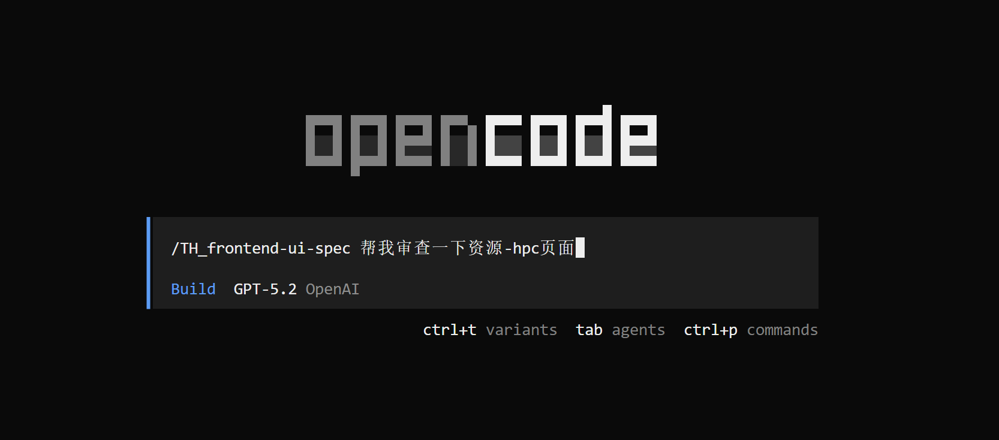
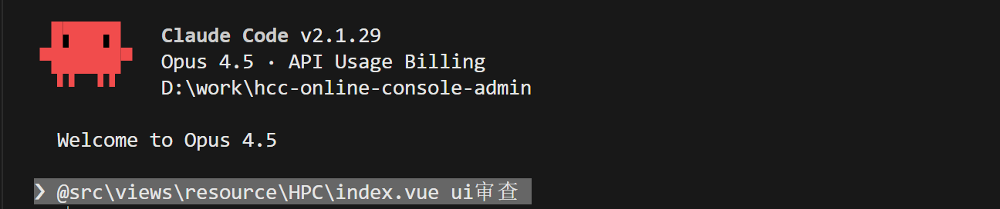

# TH-frontend-ui-spec
This is a skill designed for Claude Code, Codex, or OpenCode, used for TH Company's UI review or UI specifications.

How to Use:
After downloading the file, copy the TH-frontend-ui-spec file to C:\Users\{Your Username}\.config\opencode\skills or C:\Users\{Your Username}\.claude\skills. Then, simply restart OpenCode or Claude Code.
Then, use /skill to select /TH_frontend-ui-spec, and specify a page or project to apply it to

For example, here are screenshots of how I use it in OpenCode and Claude Code.

